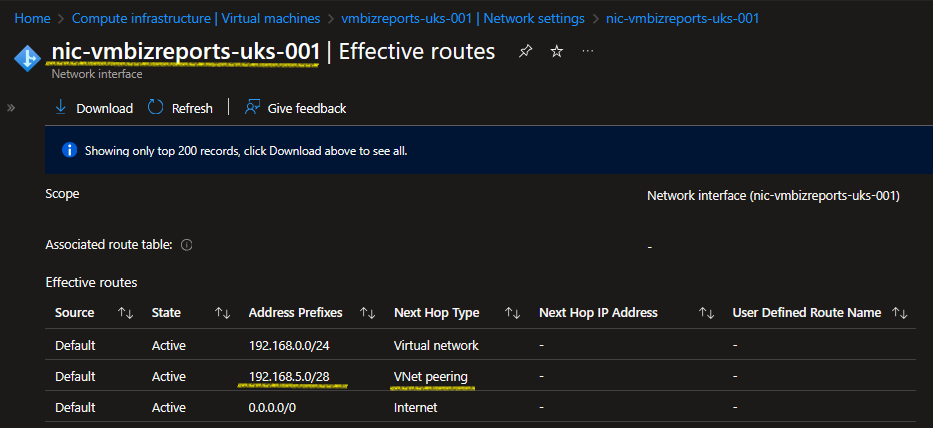

# 001 Azure Subnet Peering

* Aim: illustrate subnet peering in the MSFT Azure public cloud.

## Architecture


* The hub virtual network, `VNET-HUB-UKS-001`, contains an IIS server, `vmiiscore-uks-001`, that can communicate with x2 vms in peered subnets in virutal network, `VNET-SPOKE-UKS-001`.
  * Illustrated by the green subnet peering lines in the center of the architectural diagram.
* Subnet peering is established between `snet-iiscore-frontend`, and `snet-sql-backend` and `snet-integration-backend` respectivley.
* The highly sensitive HSM workload in subnet `snet-hsm-backend` is intentionally isolated — subnet peering is not established between it and `snet-iiscore-frontend`, preventing any communication with the IIS server.
* Access between peered subnets is further restricted using network security groups `nsg-hub-uks-001` and `nsg-spokes-uks-001`. Enforcing least privilege and east-west traffic control.

## Deployment 

* Authenticate to azure and set the subscription context
  * `az login`
  * `az account set -s <your subscription id>`
  * `az account show`
* Within directory `tfm_iac\` run terraform commands workflow:
  * `terraform init`
  * `terraform plan -out snet_peering.tfplan` 
  * `terraform apply -auto-approve ".\snet_peering.tfplan"`
* Test accessing the iis frontend server: 
  * `http://192.168.5.4`
  * `curl http://192.168.5.4`
* Review subnet peering details using the Azure CLI: 
```
az network vnet peering show `
  --resource-group "RG-ZIMCANIT-SNETPEERING-DMO-UKS-001" `
  --vnet-name "VNET-HUB-UKS-001" `
  --name "vnet-hub-uks-001--to--vnet-spoke-uks-001" `
  --output json > vnet_hub_peering_info.txt
```
  * Within file: `vnet_hub_peering_info.txt`, review attributes such as `localSubnetNames`, `remoteSubnetNames`, `localVirtualNetworkAddressSpace` and `remoteVirtualNetworkAddressSpace` to validate peering configuration.

## Caveats

* The effective routes table for server, `vmbizreports-uks-001`, within non-peered subnet `snet-hsm-backend` will show a route to the iis server workload. Despite subnet peering explicity excluding the hsm subnet.
* ***Root cause***: Peering still occurs at the VNet level in Azure as effective routes are propagated for the entire remote VNet's CIDR range to the network interface cards in the local subnet. 
  * The route `192.168.5.0/28` (`snet-iiscore-frontend`) is injected into the HSM vm's effective route table.



* Explicitly defining the local and remote subnet names in the peering definition restricts traffic flow to-and-fro the HSM and IIS servers:
  * VNet peering definition TFM code: 

```
resource "azurerm_virtual_network_peering" "hub_to_spoke" {
  name                      = "VNET-HUB-UKS-001--to--VNET-SPOKE-UKS-001"
  resource_group_name       = azurerm_resource_group.rg.name
  virtual_network_name      = module.hub_vnet.name
  remote_virtual_network_id = module.spoke_vnet.resource_id
  allow_virtual_network_access = true
  allow_forwarded_traffic = false
  allow_gateway_transit = false 
  peer_complete_virtual_networks_enabled = false
  use_remote_gateways = false 

  local_subnet_names = [
    module.hub_vnet.subnets["snet-iiscore-frontend"].name
  ]

  remote_subnet_names = [
    module.spoke_vnet.subnets["snet-sql-backend"].name,
    module.spoke_vnet.subnets["snet-integration-backend"].name
  ]
}

resource "azurerm_virtual_network_peering" "spoke_to_hub" {
  name                      = "VNET-SPOKE-UKS-001--to--VNET-HUB-UKS-001"
  resource_group_name       = azurerm_resource_group.rg.name
  virtual_network_name      = module.spoke_vnet.name
  remote_virtual_network_id = module.hub_vnet.resource_id
  allow_virtual_network_access = true
  allow_forwarded_traffic = false
  allow_gateway_transit = false 
  peer_complete_virtual_networks_enabled = false
  use_remote_gateways = false 
  
  local_subnet_names = [
    module.spoke_vnet.subnets["snet-sql-backend"].name,
    module.spoke_vnet.subnets["snet-integration-backend"].name
  ]

  remote_subnet_names = [
    module.hub_vnet.subnets["snet-iiscore-frontend"].name
  ]
}
```


## Resource destruction 

* Within directory `tfm_iac\` run the terraform command: `terraform destroy -auto-approve`
* Logout of azure: `az logout`

## Docs

* [How to configure subnet peering](https://learn.microsoft.com/en-us/azure/virtual-network/how-to-configure-subnet-peering)
* [avm-res-network-virtualnetwork](https://registry.terraform.io/modules/Azure/avm-res-network-virtualnetwork/azurerm/latest)
* [Download `Multi-Remote Next Generation Connection Manager`](https://mremoteng.org/download)